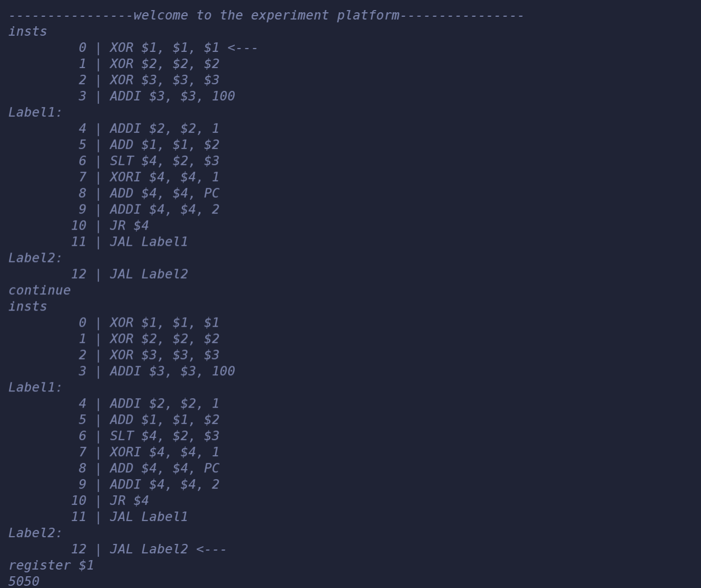

# naive-assembly

整了发微微微微指令集计算机

架构相当简单，四舍五入没有架构，内存管理没有。

存储字长为32位（就是C++的int），指令字长也是32位，采取小端存储。

所有立即数都是16位/32位有符号整数$[-2^{31},2^{31})$。

32个通用寄存器，3个特殊寄存器，然后由于我还没支持call子程序，导致什么中断向量异常向量一大堆没用的通用寄存器。

寻址方式只支持一种"立即数(寄存器)"，就是寄存器+立即数寻址==。

在启动时，会把boot.asm里的指令写到$0x000000$~？单元（取决于程序长度，没有什么自检程序所以就从0开始了），然后把偏移量记到$\$7$寄存器里，这样立即数($\$7$)就可以很方便地访问内存单元了==（真是简单暴力呢）

也会有label_map来模拟label地址映射关系。

总之完全为了执行一个boot.asm服务的模拟汇编环境。支持的指令：

```C++
enum Opcode {
    ADDI,   // ADDI rt, rs, imm16;  rt <- rs + imm16                    000000 = 0
    SUBI,   // SUBI rt, rs, imm16;  rt <- rs - imm16                    000001 = 1
    ANDI,   // ANDI rt, rs, imm16;  rt <- rs & imm16                    000010 = 2
    ORI,    // ORI rt, rs, imm16;   rt <- rs | imm16                    000011 = 3
    XORI,   // XORI rt, rs, imm16;  rt <- rs ^ imm16                    000100 = 4

    ADD,    // ADD rd, rs, rt;      rd <- rs + rt                       000101 = 5
    SUB,    // SUB rd, rs, rt;      rd <- rs - rt                       000110 = 6
    OR,     // OR rd, rs, rt;       rd <- rs | rt                       000111 = 7
    AND,    // AND rd, rs, rt;      rd <- rs & rt                       001000 = 8
    XOR,    // XOR rd, rs, rt;      rd <- rs ^ rt                       001001 = 9
    SLT,    // SLT rd, rs, rt;      rd <- rs < rt ? 1 : 0               001010 = 10

    MUL,    // MUL rs, rt;          [HI : LO] <- rs * rt                001011 = 11
    DIV,    // DIV rs, rt;          rs / rt = LO ...... HI              001100 = 12

    MULI,   // MULI rs, imm16;      [HI : LO] <- rs * imm16             001101 = 13
    DIVI,   // DIVI rs, imm16;      rs / imm16 = LO ...... HI           001110 = 14

    LW,     // LW rt address;       rt <- storage[address]              001111 = 15
    SW,     // SW rt address;       storage[address] <- rt              010000 = 16

    JAL,    // JAL Label;           ra <- PC + 1, PC <- (Label)         010001 = 17
    JR,     // JR rt;               PC <- rt                            010010 = 18
    LUI,    // LUI rt, imm16;       rt <- (imm16 << 16)                 010011 = 19

    RET,    // RET;                 PC <- ra                            010100 = 20
};
```

然后 boot后支持的操作：

```c++
clear
cls		//清空控制台
state	//打印系统内存寄存器状态
exec	//执行一条指令
reboot	//重启，重新载入boot.asm
now_command //打印即将执行的下一条指令
register $2 //查询$2寄存器内容
continue	//连续执行一万次指令
insts		//打印当前指令执行情况
execn 10	//连续执行10次指令
quit		//退出
```

我并没有加断点啥的很懒==

给出一个计算1+2+3+....+100循环的程序例子：

```assembly
XOR $1, $1, $1;
XOR $2, $2, $2;
XOR $3, $3, $3;    清零
ADDI $3, $3, 100;
Label1:
    ADDI $2, $2, 1;
    ADD  $1, $1, $2;
    SLT $4, $2, $3;
    XORI $4, $4, 1;
    ADD $4, $4, PC;
    ADDI $4, $4, 2;
    JR $4;
JAL Label1;

Label2:
    JAL Label2;
```

运行结果：

